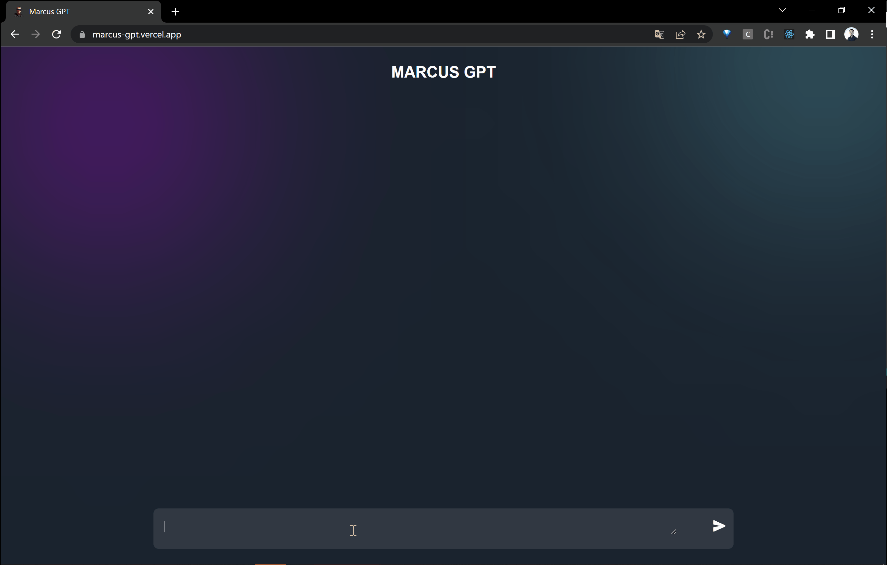

# MarkusGPT-ING-April2023

This is a personal GPT4/3.5 chatbot whose name is Markus. Please check the website: [Markus GPT Chatbot](https://marcus-gpt.vercel.app/) for any updating.

- [x] First UI for basic GPT chat model.
- [x] Assign safty info to back end.
- [x] Add prompt function.
- [ ] Optimize prompt interface.

## The first version of Makus 😅 (04/08/2023)

(Source ref. [Build ChatGPT AI Tool in React JS | React JS Project with Working Example using OpenAI API](https://www.youtube.com/watch?v=vAO1fxifJIs))

## The second version of Makus + Prompt bubbles 😎 (04/09/2023)
